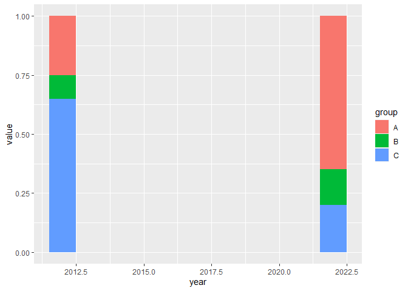
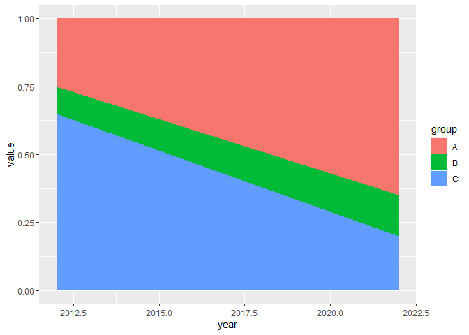
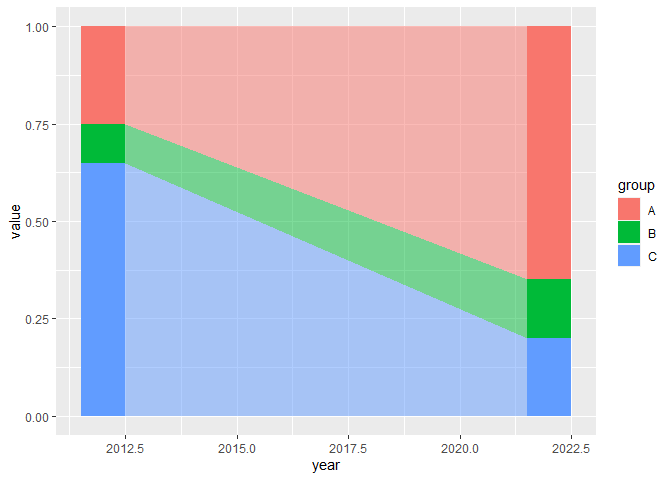
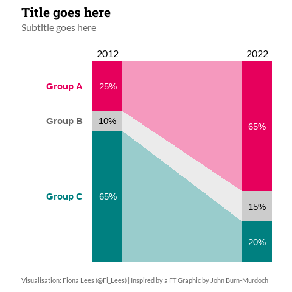

### Objective
To work out how to create a chart similar to one [published by the Financial Times](https://twitter.com/jburnmurdoch/status/1525766121776943107), by John Burn-Murdoch. The chart contains two stacked-bars, connected by an area chart. 


### Load Packages


```r
library(showtext)
library(tidyverse)
library(ggrepel)
```

### Import Data
 

```r
my_data <- readxl::read_excel("data/data_for_chart.xlsx")
```


```r
view(my_data)
glimpse(my_data)
```

```
## Rows: 6
## Columns: 3
## $ year  <dbl> 2022, 2022, 2022, 2012, 2012, 2012
## $ group <chr> "A", "B", "C", "A", "B", "C"
## $ value <dbl> 0.65, 0.15, 0.20, 0.25, 0.10, 0.65
```


### Explore Options 

Create stacked bar chart.  
 

```r
my_data %>% 
  ggplot(aes(x = year, y = value, fill = group)) + 
  geom_bar(position = "stack", stat = "identity", width = 1)
```



Create area chart.  


```r
my_data %>% 
  ggplot(aes(x = year, y = value, fill = group)) + 
  geom_area()
```



Put the stacked bars and the area chart together. Adjust the start and end points of the area chart so that it meets the edges of the stacked bars.  


```r
my_data %>% 
  ggplot(aes(x = year, y = value, fill = group)) + 
  # stacked bars
  geom_bar(position = "stack", stat = "identity", width = 1) +
  # area chart
  geom_area(
    aes(x = ifelse(year == 2012, year + 0.5, year - 0.5)), # width adjustment
    alpha = 0.5 # add transparency
  )
```




### Visualise Data

Build the final visualisation.  


```r
# Load fonts
showtext_auto(enable = TRUE)
font_add_google("Lato")
font_add_google("Roboto Slab")
```


```r
# Define colour palette  
my_pal <- c("#e6005c", "grey80", "#008080")
my_pal_2 <- c("#e6005c", "grey40", "#008080")
```


```r
# Create final chart
p_final <- my_data %>% 
  ggplot(aes(x = year, y = value, fill = group)) + 
  # Stacked bars
  geom_bar(position = "stack", stat = "identity", width = 2) +
  # Area chart
  geom_area(
    aes(x = ifelse(year == 2012, year + 1, year - 1)),
    alpha = 0.4
    ) +
  # Percentage labels 
  geom_text(
    aes(label = scales::percent(value)),
    position = position_stack(vjust = 0.5),
    size = 3.88,
    colour = c("white", "black", "white", "white", "black", "white")
    ) +
  # Group labels
  geom_text_repel(
    data = filter(my_data, year == 2012),
    aes(label = str_c("Group ", group)),
    position = position_stack(vjust = 0.5),
    direction = "x",
    xlim = c(2007, 2010.5),
    segment.colour = NA,
    size = 3.88,
    fontface = "bold",
    colour = my_pal_2
    ) +
  # Colour
  scale_fill_manual(values = my_pal) +
  # Scales
  scale_x_continuous(limits = c(2007, 2023), breaks = (c(2012, 2022)), position = "top") +
  scale_y_continuous(expand = expansion(add = 0)) +
  # Styling
  theme_minimal() +
  theme(
    text = element_text(family = "Lato", colour = "grey40", size = 12),
    plot.title = element_text(family = "Roboto Slab", colour = "black", size = 16, 
                              face = "bold", margin = margin(b = 5), hjust = 0),
    plot.subtitle = element_text(size = 12, hjust = 0),
    plot.caption = element_text(size = 8, margin = margin(t = 20), hjust = 0),
    plot.background = element_rect(colour = "white", fill = "white"),
    axis.ticks.y = element_blank(),
    axis.text.y = element_blank(),
    axis.text.x = element_text(size = 12, colour = "black"),
    panel.grid = element_blank(),
    legend.position = "none",
    plot.margin = margin(t = 10, r = 10, b = 10, l = 10)
    ) +
  # Titles
  labs(
    title = "Title goes here",
    subtitle = "Subtitle goes here",
    x = "", 
    y = "",
    caption = "Visualisation: Fiona Lees (@Fi_Lees) | Inspired by a FT Graphic by John Burn-Murdoch"
    )

p_final 
```



Save the plot as an image.  


```r
# Tell showtext to use DPI of 320 so text size is correct when chart is saved as an image
showtext_opts(dpi = 320)

# Save plot as image
ggsave("bars_connected_by_area.png", p_final, width = 5, height = 5, units = "in", dpi = 320)

# Turn off showtext
showtext_auto(FALSE)
```


### Session Information

```r
sessionInfo()
```

```
## R version 4.2.0 (2022-04-22 ucrt)
## Platform: x86_64-w64-mingw32/x64 (64-bit)
## Running under: Windows 10 x64 (build 22000)
## 
## Matrix products: default
## 
## locale:
## [1] LC_COLLATE=English_United Kingdom.utf8 
## [2] LC_CTYPE=English_United Kingdom.utf8   
## [3] LC_MONETARY=English_United Kingdom.utf8
## [4] LC_NUMERIC=C                           
## [5] LC_TIME=English_United Kingdom.utf8    
## 
## attached base packages:
## [1] stats     graphics  grDevices utils     datasets  methods   base     
## 
## other attached packages:
##  [1] ggrepel_0.9.1   forcats_0.5.1   stringr_1.4.0   dplyr_1.0.9    
##  [5] purrr_0.3.4     readr_2.1.2     tidyr_1.2.0     tibble_3.1.7   
##  [9] ggplot2_3.3.6   tidyverse_1.3.1 showtext_0.9-5  showtextdb_3.0 
## [13] sysfonts_0.8.8 
## 
## loaded via a namespace (and not attached):
##  [1] Rcpp_1.0.8.3      lubridate_1.8.0   assertthat_0.2.1  digest_0.6.29    
##  [5] utf8_1.2.2        R6_2.5.1          cellranger_1.1.0  backports_1.4.1  
##  [9] reprex_2.0.1      evaluate_0.15     highr_0.9         httr_1.4.3       
## [13] pillar_1.7.0      rlang_1.0.2       curl_4.3.2        readxl_1.4.0     
## [17] rstudioapi_0.13   jquerylib_0.1.4   rmarkdown_2.14    textshaping_0.3.6
## [21] labeling_0.4.2    munsell_0.5.0     broom_0.8.0       compiler_4.2.0   
## [25] modelr_0.1.8      xfun_0.31         systemfonts_1.0.4 pkgconfig_2.0.3  
## [29] htmltools_0.5.2   tidyselect_1.1.2  fansi_1.0.3       crayon_1.5.1     
## [33] tzdb_0.3.0        dbplyr_2.2.0      withr_2.5.0       grid_4.2.0       
## [37] jsonlite_1.8.0    gtable_0.3.0      lifecycle_1.0.1   DBI_1.1.3        
## [41] magrittr_2.0.3    scales_1.2.0      cli_3.3.0         stringi_1.7.6    
## [45] farver_2.1.0      fs_1.5.2          xml2_1.3.3        bslib_0.3.1      
## [49] ragg_1.2.2        ellipsis_0.3.2    generics_0.1.2    vctrs_0.4.1      
## [53] tools_4.2.0       glue_1.6.2        hms_1.1.1         fastmap_1.1.0    
## [57] yaml_2.3.5        colorspace_2.0-3  rvest_1.0.2       knitr_1.39       
## [61] haven_2.5.0       sass_0.4.1
```

